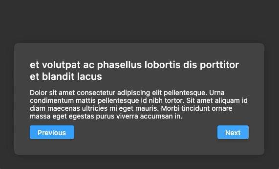

# Live Code Examples

Several live code examples I've shown during [my live sessions on Twitch](https://twitch.tv/aloisdeniel) (*in french only, sorry...*). 

## 001 - *Sticky Headers*

The idea of this example, is to implement Slack's sticky headers !

# 002 - *AnimatedSwitcher, AnimatedSize*

The idea of this example, is a container which size and content is animated implicitely.